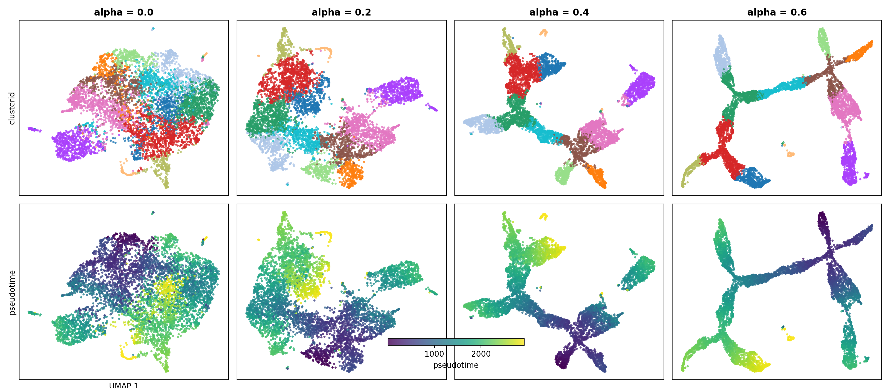

# PGD: Pseudotime Graph Diffusion

[](https://pypi.org/project/pgdiffusion/)
[](https://www.python.org/downloads/)
[](LICENSE)

**PGD** is a lightweight library for random-walk feature diffusion on pseudotime graphs. It smooths single-cell embeddings and features along cell trajectories, enhancing pseudotime structure and denoising features in a trajectory-aware way.

## Features

- 📊 **Graph construction** from branched cell trajectories  
- 🔄 **Random-walk diffusion** on pseudotime graphs
- 🚀 **PyTorch-based** for GPU acceleration
- 📦 **scverse-compatible** with AnnData integration
- 🎯 **Simple API** with two core functions

## Installation

PGDiffusion is not yet published on PyPI. Install directly from Git or from source:

```bash
# install straight from Git
pip install git+https://github.com/brandonlukas/pgdiffusion.git

# or editable install from a clone
git clone https://github.com/brandonlukas/pgdiffusion.git
cd pgdiffusion
pip install -e .
```

## Quick Start

```python
import torch
import scanpy as sc
import pgdiffusion as pgd

# Load data
adata = sc.read_h5ad("data.h5ad")

# Define branched trajectories
trajectories = {
  "epithelial": ["cell_0", "cell_1", "cell_2", "cell_3"],
  "mesenchymal": ["cell_2", "cell_4", "cell_5"],
}

# Get embeddings (e.g., PCA)
X = torch.tensor(adata.obsm["X_pca"], dtype=torch.float32)

# Build pseudotime graph
edge_index = pgd.build_graph(adata, trajectories, neighbors_per_side=50)
edge_index = torch.tensor(edge_index, dtype=torch.long)

# Apply diffusion
X_smooth = pgd.diffuse(X, edge_index, alpha=0.6, n_steps=1)

# Store results
adata.obsm["X_pseudotime"] = X_smooth.cpu().numpy()

# Visualize
sc.pp.neighbors(adata, use_rep="X_pseudotime")
sc.tl.umap(adata)
sc.pl.umap(adata, color=["pseudotime"])
```

## Mathematical Foundation

### Graph Construction

Given branched trajectories where each branch defines an ordered cell sequence, edges connect cells within a sliding window along the pseudotime ordering:

$$c_i \text{ connects to } c_j \text{ if } |i - j| \leq k$$

Here $k$ is the sliding-window radius. Edges are bidirectional, and self-loops are excluded.

**Multi-branch handling**: If multiple branches share an edge between the same cell pair, the shortest positional distance is retained.

### Feature Diffusion

PGD performs iterative feature smoothing via an incoming random-walk operator on the pseudotime graph, combined with a residual connection.

In the simplest case (unweighted graph, no feature coupling), one diffusion step is

$$X^{(t+1)} = (1 - \alpha)\, X^{(t)} + \alpha\, P X^{(t)}$$

where $P = D^{-1} A$ is the incoming random-walk operator, $A$ is the adjacency matrix, and $D$ is the diagonal in-degree matrix.

Equivalently, each cell updates its features by averaging over its incoming neighbors along the pseudotime graph.

#### Extensions
- **Weighted edges**: adjacency entries are replaced by edge weights and
  normalized by weighted in-degree.
- **Feature coupling**: after aggregation, features may be transformed using
  either:
  - an explicit mixing matrix $M$, or
  - a low-rank coupling $I + \beta U U^\top$ (e.g., PCA loadings).
- **Self-loops**: optional self-edges may be included inside the aggregation
  operator, in addition to the residual term.

**Computational Efficiency**: Uses in-place PyTorch scatter operations (`index_add_`) and degree clamping for GPU efficiency and numerical stability.

## API Reference

### `build_graph()`

Constructs a sparse pseudotime graph from branched cell trajectories.

**Parameters**:
- `adata` (AnnData): Cell annotation object
- `branch_trajectories` (Mapping[str, Sequence[str]]): Branch name → ordered cell IDs
- `neighbors_per_side` (int): Radius of sliding window (default: 50)
- `include_step_attr` (bool): Return edge positional steps (default: False)

**Returns**:
- `edge_index` (np.ndarray): Shape (2, n_edges) sparse edges
- `edge_attr` (np.ndarray, optional): Shape (n_edges,) positional steps


### `diffuse()`

Applies random-walk feature diffusion on a pseudotime graph.

**Parameters**:
- `X` (torch.Tensor): Feature matrix of shape (n_cells, n_features)
- `edge_index` (torch.Tensor): Sparse edge list of shape (2, n_edges),
  with edges interpreted as src → dst (aggregation into dst)
- `alpha` (float): Blend weight in [0, 1] (default: 0.6)
- `n_steps` (int): Number of diffusion iterations (default: 1)
- `edge_weight` (torch.Tensor | None): Optional non-negative per-edge weights
  aligned with edge_index (default: None)
- `add_self_loops` (bool): If True, include self-loops inside the aggregation
  operator (default: False)
- `self_loop_weight` (float): Weight assigned to self-loop edges when
  add_self_loops=True (default: 1.0)
- `M` (torch.Tensor | None): Optional explicit feature-mixing matrix of shape
  (n_features, n_features) (mutually exclusive with U)
- `U` (torch.Tensor | None): Optional low-rank feature coupling of shape
  (n_features, r) (e.g., PCA loadings; mutually exclusive with M)
- `beta` (float): Coupling strength for low-rank feature coupling
  (default: 0.0)

**Returns**:
- `X_smooth` (torch.Tensor): Diffused features with the same shape as X

**Notes**:
- Aggregation is performed over incoming neighbors (src → dst).
- Only one of `M` or `U` may be provided.
- Edge weights and self-loop weights must be finite and non-negative.

## Example: Alpha Effect on Embeddings

Actual scRNA-seq data with pseudotime and branch trajectories inferred using a cluster-based minimum spanning tree (cMST) approach (Lamian). Grid showing diffusion strength (α ∈ {0.0, 0.2, 0.4, 0.6}). Top row colored by clusterid, bottom row by pseudotime.



## Citation

If you use PGD in your research, please cite:

```bibtex
@software{pgdiffusion2025,
  title={PGD: Pseudotime Graph Diffusion},
  author={Lukas, Brandon},
  year={2025},
  url={https://github.com/brandonlukas/pgdiffusion}
}
```

## License

PGD is licensed under the [MIT License](LICENSE).
