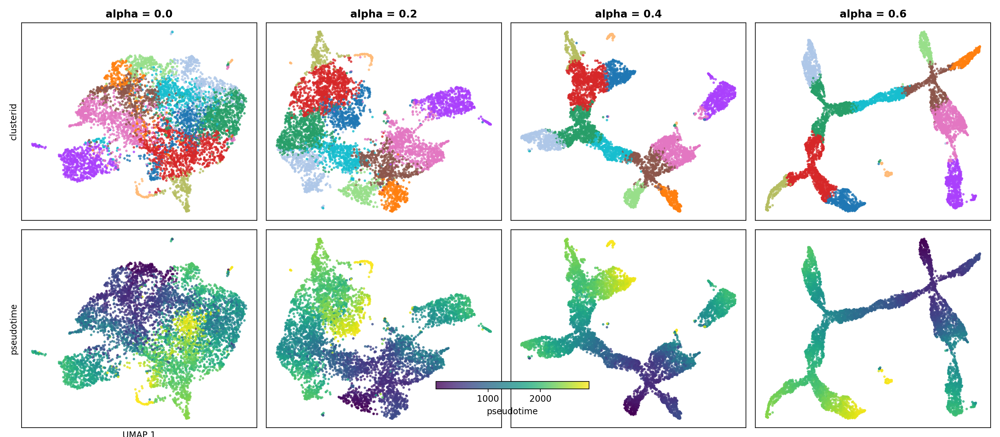

# PGD: Pseudotime Graph Diffusion

[](https://pypi.org/project/pgdiffusion/)
[](https://www.python.org/downloads/)
[](LICENSE)

**PGD** is a lightweight library for random-walk feature diffusion on pseudotime graphs. It smooths single-cell embeddings along cell trajectories, denoising features in a trajectory-aware way.

## Features

- 🔄 **Random-walk diffusion** on pseudotime graphs with efficient GPU support
- 📊 **Trajectory-aware graph construction** from branched cell trajectories  
- 🚀 **PyTorch-based** for GPU acceleration and automatic differentiation
- 📦 **scverse-compatible** with AnnData integration
- 🎯 **Simple API** with two core functions

## Installation

PGDiffusion is not yet published on PyPI. Install from source or directly from Git:

```bash
# editable install from a clone
git clone https://github.com/brandonlukas/pgdiffusion.git
cd pgdiffusion
pip install -e .

# or install straight from Git without cloning
pip install git+https://github.com/brandonlukas/pgdiffusion.git
```

## Quick Start

```python
import scanpy as sc
import torch
import pgdiffusion as pgd

# Load data
adata = sc.read_h5ad("data.h5ad")

# Define branched trajectories
trajectories = {
  "epithelial": ["cell_0", "cell_1", "cell_2", "cell_3"],
  "mesenchymal": ["cell_2", "cell_4", "cell_5"],
}

# Get embeddings (PCA, UMAP, etc.)
X = torch.tensor(adata.obsm["X_pca"], dtype=torch.float32)

# Build pseudotime graph
edge_index = pgd.build_graph(adata, trajectories, neighbors_per_side=50)

# Apply diffusion
X_diffused = pgd.diffuse(
  X,
  torch.tensor(edge_index, dtype=torch.long),
  alpha=0.6,
  n_steps=1,
)

# Store results
adata.obsm["X_pseudotime"] = X_diffused.cpu().numpy()

# Visualize
sc.pp.neighbors(adata, use_rep="X_pseudotime")
sc.tl.umap(adata)
sc.pl.umap(adata, color=["pseudotime"])
```

## Mathematical Foundation

### Graph Construction

Given branched trajectories where each branch defines an ordered cell sequence, edges connect cells within a sliding window along the pseudotime ordering:

$$c_i \text{ connects to } c_j \text{ if } |i - j| \leq k$$

Here $k$ is the sliding-window radius (`neighbors_per_side`). Edges are bidirectional, and self-loops are excluded.

**Multi-branch handling**: If multiple branches share an edge between the same cell pair, the shortest positional distance is retained.

### Feature Diffusion

The diffusion operation performs iterative feature smoothing via random-walk aggregation:

$$X^{(t+1)}_i = (1 - \alpha) X^{(t)}_i + \alpha \cdot \text{mean}_{j \in N(i)} X^{(t)}_j$$

where:
- $X^{(t)}_i$ is the feature vector of cell $i$ at iteration $t$
- $N(i)$ is the set of neighbors of node $i$ in the pseudotime graph
- $\alpha \in (0, 1]$ controls the blending weight

**Parameter Effects**:
- $\alpha = 0$: no diffusion (identity)
- $\alpha = 0.5$: balanced blend of own and neighbor features
- $\alpha = 1$: pure neighbor aggregation

**Computational Efficiency**: Uses in-place PyTorch scatter operations (`index_add_`) and degree clamping for GPU efficiency and numerical stability.

## API Reference

### `build_graph()`

Constructs a sparse pseudotime graph from branched cell trajectories.

**Parameters**:
- `adata` (AnnData): Cell annotation object
- `branch_trajectories` (Mapping[str, Sequence[str]]): Branch name → ordered cell IDs
- `neighbors_per_side` (int): Radius of sliding window (default: 50)
- `include_step_attr` (bool): Return edge positional steps (default: False)

**Returns**:
- `edge_index` (np.ndarray): Shape (2, E) sparse edges
- `edge_attr` (np.ndarray, optional): Shape (E,) positional steps

### `diffuse()`

Applies random-walk feature diffusion on the graph.

**Parameters**:
- `X` (torch.Tensor): Feature matrix (n_cells, n_features)
- `edge_index` (torch.Tensor): Sparse edges (2, n_edges)
- `alpha` (float): Blending weight ∈ (0, 1] (default: 0.6)
- `n_steps` (int): Number of iterations (default: 1)
- `add_self_loops` (bool): Add residual self-loops (default: True)

**Returns**:
- `X_diffused` (torch.Tensor): Smoothed features, same shape as X

## Visualization: Alpha Effect on Embeddings

Static grid showing diffusion strength (α ∈ {0.0, 0.2, 0.4, 0.6}). Top row colored by `clusterid`, bottom row by `pseudotime`.



## Design Principles

- **Biological meaningfulness**: Edges reflect trajectory distance, not arbitrary similarity
- **Computational efficiency**: GPU-native operations with in-place scatter aggregation
- **Device-agnostic**: Automatically uses GPU if available; falls back to CPU
- **Composable**: Works with any PyTorch tensor format and existing scanpy workflows

## Contributing

Contributions welcome! Please:
1. Fork the repository
2. Create a feature branch (`git checkout -b feature/my-feature`)
3. Add tests and update docstrings
4. Submit a pull request

## Citation

If you use PGD in your research, please cite:

```bibtex
@software{pgdiffusion2025,
  title={PGD: Pseudotime Graph Diffusion},
  author={Lukas, Brandon},
  year={2025},
  url={https://github.com/brandonlukas/pgdiffusion}
}
```

## License

PGD is licensed under the [MIT License](LICENSE).
